#Hit-the-Mole

Das ist ein von mir entwickeltes Pyhton-Spiel für die Uni.

Das Spiel dauert 30 Sekunden. Ziel ist es, so oft wie möglich den Maulwurf anzuklicken, der zufällig auf dem Bildschirm erscheint. Jeder Klick bringt einen Punkt, danach taucht der Maulwurf an einer neuen Stelle wieder auf.

Hinweis: Für weitere Entwicklungen bitte den Branch "dev" verwenden.
         Der Branch "feature" dient zur Entwicklung neuer Funktionen.

 -------------------------------------------------------------------------------------------------------     

Im Folgenden ist meine Einsendeaufgabe DVC-E1 zum Thema Versionsverwaltung mit Git dokumentiert.

Als erstes habe ich in Github ein neues Repository erstellt. 
Anschließend habe ich das Git-Repository lokal im Projektordner initialisiert. Danach wurde das Remote-Repository bei GitHub verknüpft. Abschließend habe ich alle Projektdateien hinzugefügt und mit einem passenden Commit ins Repository hochgeladen. Damit die Daten im Remote-Repository liegen, habe ich den Hauptbranch auf „main“ umbenannt und anschließend alles hochgeladen. 
 
   

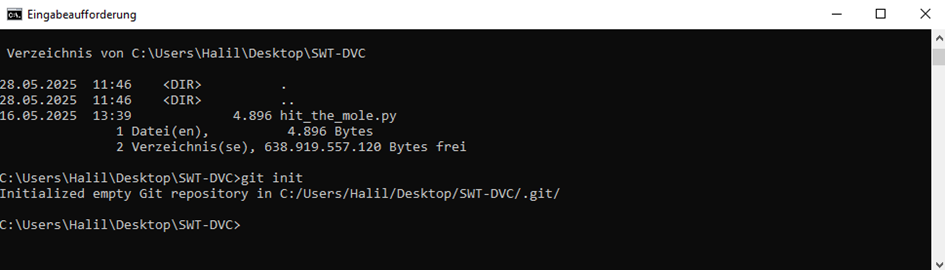

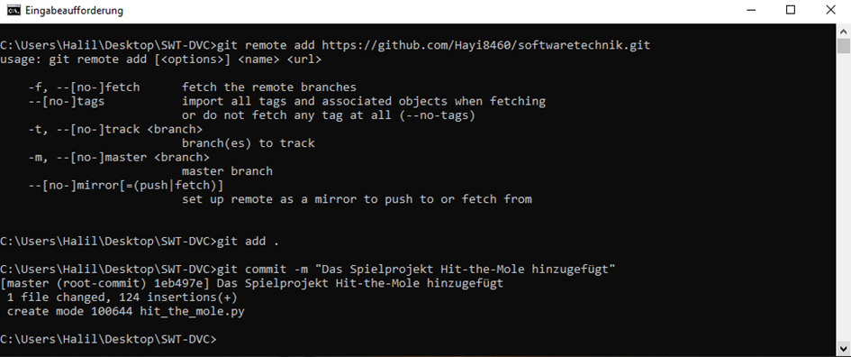

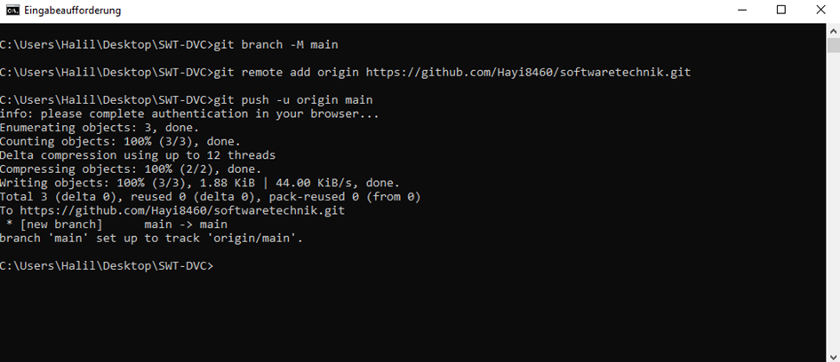

Nun möchte ich anhand meines Projekts den Umgang mit verschiedenen Git-Befehlen nachvollziehbar machen.

Mit git status ist zu sehen, dass ein Commit noch nicht gepusht wurde.
Da alle Änderungen bereits committed sind, zeigt git diff aktuell nichts an.
Hätte ich den Befehl direkt nach git add ausgeführt, wären die Unterschiede sichtbar gewesen.
 
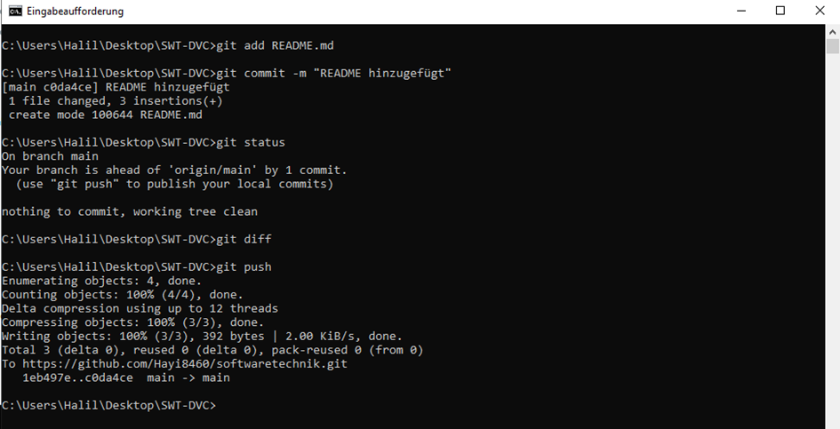

git pull ist vor allem im Team nützlich, da man damit prüfen kann, ob es Änderungen im Remote-Repository gibt. In meinem Fall entsprach der Remote-Stand bereits dem lokalen Stand. 

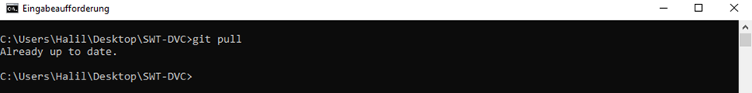

git mv wird verwendet, um Dateien umzubenennen oder in einen anderen Ordner zu verschieben. 

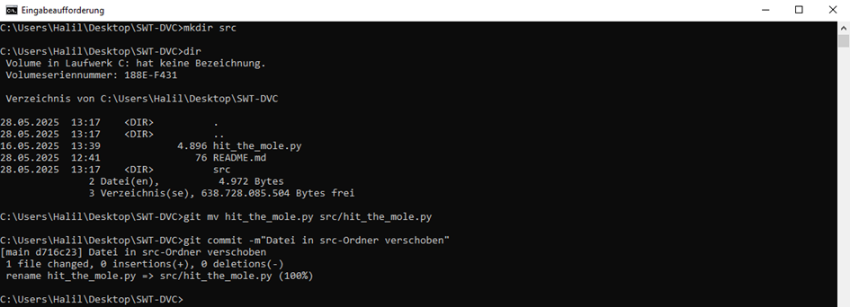

git rm wird verwendet, um Dateien zu löschen.
 
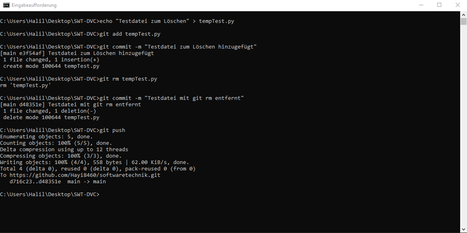

Mit git clone kann man das Repository von GitHub an einem neuen Ort lokal speichern.
 
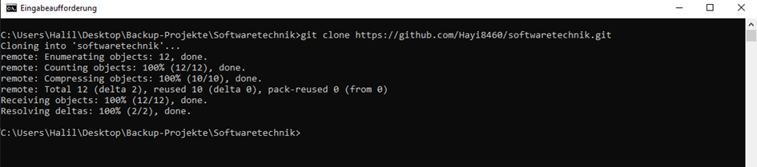

Nun kommen wir mal zu einer Zeitreise.
Bevor wir reisen sollten wir erst einmal schauen zu welchen Zeitpunkten wir springen wollen. Anschließend reisen wir durch die Zeit und erstellen an einem bestimmten Punkt eine neue Dimension, um Veränderungen dort getrennt zu halten. Wie in der Physik kann es zu Zeitkomplexitäten kommen, die in unserem Fall technisch zum Glück einfacher zu lösen sind.

Kurz und technisch gesagt zeigen wir uns die Commits an, wechseln zu einem gewünschten Zeitpunkt, nehmen unsere Änderungen in einem anderen Branch vor, um die Ordnung zu behalten und später nachvollziehen zu können was passiert ist.

 
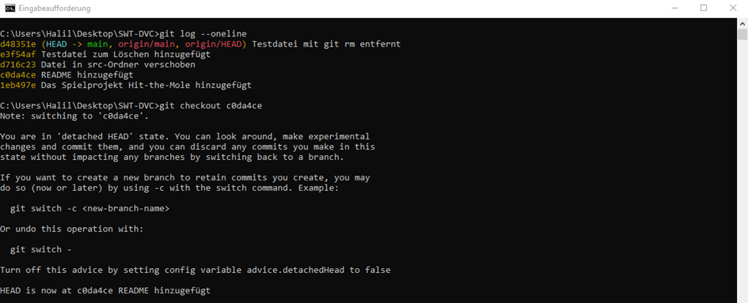
 
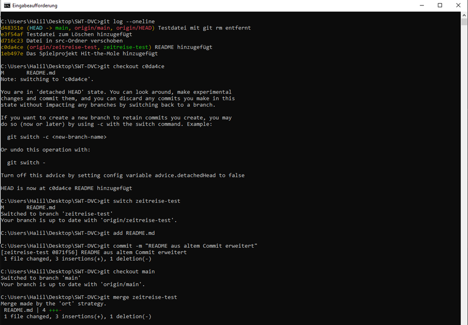

 

Im Folgenden wurden zwei unterschiedliche Branches erstellt, zwischen ihnen gewechselt und anschließend wieder zusammengeführt. 

 
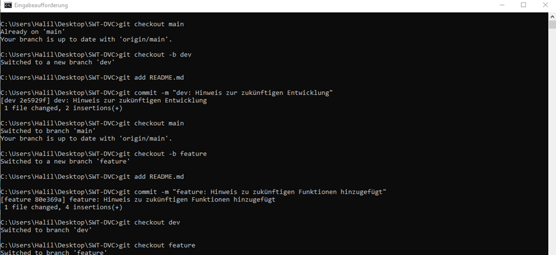

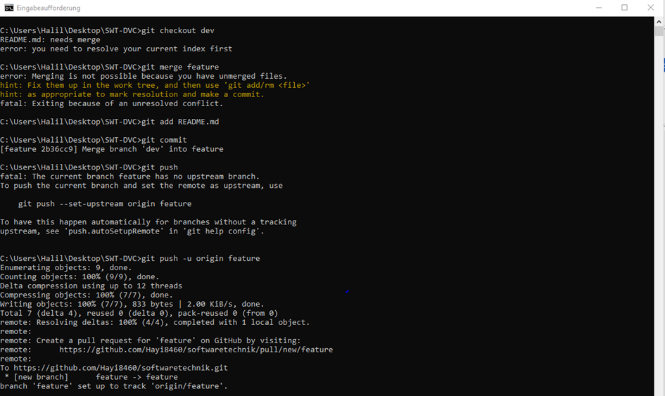

